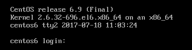

<!--
author: imkindu
date: 2017-07-18
title: /etc/issue 和 /etc/motd
tags: shell
category: linux
status: publish
summary: issue motd
-->

<link href="http://cdn.bootcss.com/highlight.js/8.0/styles/monokai_sublime.min.css" rel="stylesheet">  

　　**/etc/issue登录前欢迎语  /etc/motd 登陆后欢迎语**
 

##### 查看当前/etc/issue配置
		[imkindu@centos6 ~]$ cat /etc/issue
		CentOS release 6.9 (Final)
		Kernel \r on an \m
		\n \l \d \t

##### 问题：
> 一、如何查看issue有哪些转义字符

　　1、**先man issue查看一下，说不定有惊喜**

		[imkindu@centos6 ~]$ man issue			#首先咱们man issue
		ISSUE(5)                   Linux Programmer’s Manual                  ISSUE(5)
		
		NAME
		       issue - pre-login message and identification file
		
		DESCRIPTION
		       The  file /etc/issue is a text file which contains a message or system identi-
		       fication to be printed before the login prompt.  It may contain various  @char
		       and  \char  sequences,  if supported by the getty-type program employed on the
		       system.
		
		FILES
		       /etc/issue
		
		SEE ALSO
		       motd(5), agetty(8), mingetty(8)
		
		COLOPHON
		       This page is part of release 3.22 of the Linux man-pages project.  A  descrip-
		       tion  of  the  project,  and information about reporting bugs, can be found at
		       http://www.kernel.org/doc/man-pages/.
		
		Linux                             1993-07-24                          ISSUE(5)

　　2、**在这里，我们看到可以同样查看 man 8 mingetty,咱们试一下**

		***在man 8 mingetty里面我们看到了 字符转义 escapes 在计算机里是转义的意思***

		ISSUE ESCAPES
		   mingetty recognizes the following escapes sequences which might be embedded in
		   the /etc/issue file:
		
		   \d     insert current day (localtime),
		
		   \l     insert line on which mingetty is running,
		
		   \m     inserts machine architecture (uname -m),
		
		   \n     inserts machine’s network node hostname (uname -n),
		
		   \o     inserts domain name,
		
		   \r     inserts operating system release (uname -r),
		
		   \t     insert current time (localtime),
		
		   \s     inserts operating system name,
		
		   \u     resp. \U the current number of users which are currently logged in.  \U
		          inserts "n users", where as \u only inserts "n".
		
		   \v     inserts operating system version (uname -v).
		
		EXAMPLE
		   "Linux eos i386 #1 Tue Mar 19 21:54:09 MET 1996"  was  produced   by   putting
		   "\s \n \m \v" into /etc/issue.
		
		FILES
		   /etc/issue, /var/run/utmp.

　　３、**这样，咱们就知道了issue支持哪些转义字符**

> 二、是否可以自定义转义字符呢？暂未查到

